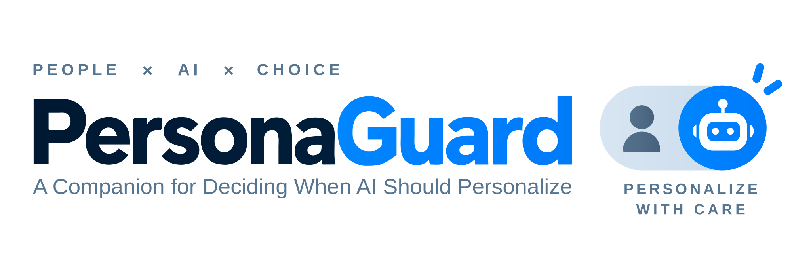

# PersonaGuard

<p align="center">
  
</p>

**A Companion for Deciding When AI Should Personalize**

Auditing Personalization Decisions in HCI Systems

English · [简体中文](README.zh-CN.md)

An executable protocol for deciding which personalization actions the available
evidence supports. Continuous valence–arousal estimation provides the worked
example, covering content priors, physiological sensing, sparse feedback, and
profile retention or transfer.

## Quick start

Python 3.10+ and Git are required. From the repository root:

```bash
# Repository tests and file audit; no research data or GPU needed
make check github-check

# Resolve the included audit cases using the Python standard library
python3 -B scripts/run_protocol_replay.py --resolve-case-set configs/protocol/protocol_replay_cases.json
```

Without Make, use `python3 -B -m unittest -v tests.test_repository_layout tests.test_export_github`
and `python3 -B scripts/check_repository.py` for the checks.
For the NumPy-based synthetic smoke test and full research environment, see the
[reproduction guide](docs/REPRODUCING.md).

## Repository

```text
src/merps/       Reusable algorithms
scripts/        Analyses, checks, exports, and figure source data
configs/        Protocol rules, cases, and stimulus manifests
results/        Aggregate results and evidence records
tests/          Unit tests and research consistency checks
docs/           Reproduction and GitHub instructions
data/           Data access and provenance documentation only
```

| Task | Guide |
|---|---|
| Install dependencies and reproduce analyses | [Reproduction](docs/REPRODUCING.md) |
| Find analysis and figure commands | [Script index](scripts/README.md) |
| Inspect rules and worked cases | [Protocol](configs/protocol/README.md) |
| Inspect results and provenance | [Results](results/README.md) |
| Export a clean source archive for GitHub | [GitHub guide](docs/GITHUB.md) |

Detailed workflow guides are currently in Chinese.

## Scope and availability

[`results/revision6_source.json`](results/revision6_source.json) is the canonical
aggregate numerical source. Current checks establish structural conformance and
deterministic replay; independent analyst reuse, usability, and user benefit
remain unevaluated. See the [recorded findings](README.zh-CN.md#results).

Raw data, weights, experiment caches, manuscript files, credentials, and backups
stay local. Full analyses require authorized data and the recorded upstream
artifacts. A repository-wide license has not yet been selected.
